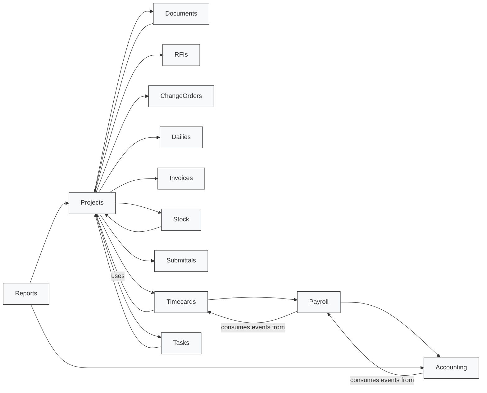

# Domain Connections

Below is a high-level UML-style domain connection diagram (Mermaid) showing which domains use or depend on others.

Summary:
- Projects is a central domain used by Documents, RFIs, ChangeOrders, Dailies, Invoices, Stock, Submittals, Timecards and Tasks.
- Timecards ↔ Payroll ↔ Accounting form the payroll/accounting chain.
- Reports consumes both project and accounting data.

Notes:
- This diagram is inferred from `app/Domains/*` usages (models, services, providers). It shows "uses/depends on" relationships, not every class-level coupling.
- If you want a more detailed class-level or event-flow UML, tell me which domains to expand.
