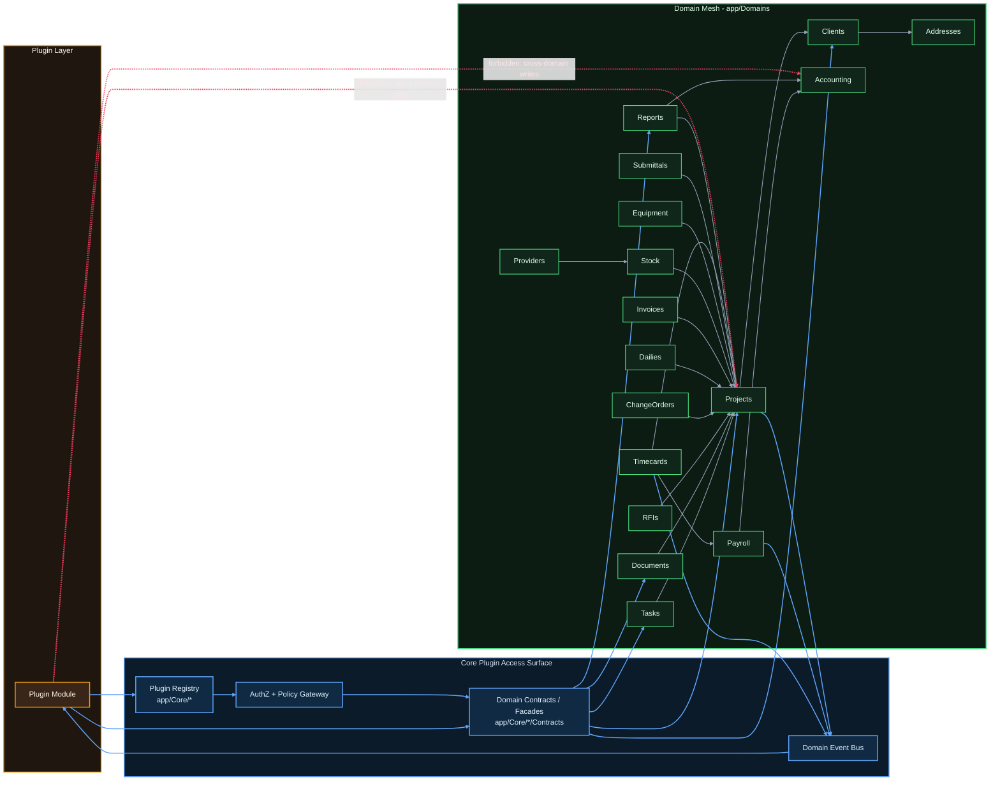

# Plugin Dependency Model

This diagram shows:
- Core domain relationships inside `app/Domains`.
- The approved plugin integration surface through `app/Core` contracts/facades.
- Forbidden coupling patterns (direct plugin calls into domain internals).

## Plugin Access Contract

1. A plugin should call app-owned contracts/facades from `app/Core/*/Contracts`, not domain services or models directly.
2. Authorization should run in the app boundary before contract execution.
3. Cross-domain workflows should be orchestrated in app/core services, not from plugin code.
4. Side-effects should be consumed through domain events where possible.

## Practical Rule Of Thumb

- Allowed: `Plugin -> Core Contract -> Domain`.
- Allowed: `Domain Event -> Plugin Subscriber`.
- Avoid: `Plugin -> app/Domains/*` direct writes or direct Eloquent access across domains.

## Built-In vs Plugin Domain Split

Use this split to decide what ships in the platform by default vs what can be optional plugins.

### Built-In Domains (Project foundation)

- Projects
- Clients
- Addresses
- Tasks
- Documents
- Timecards
- Payroll
- Accounting

Why built-in:
- These form the critical execution and financial chain.
- Most other domains either reference Project context directly or depend on this data for policy/reporting.
- Breaking these out as plugins usually creates circular dependencies.

### Plugin Candidate Domains (optional capability packs)

- RFIs
- ChangeOrders
- Dailies
- Submittals
- Equipment
- Stock
- Invoices
- Reports
- Providers

Why plugin candidates:
- They are feature verticals that can be enabled/disabled per customer profile.
- They mostly consume core Project/Client/Timecard/Accounting data.
- They can expose capabilities through contracts/events without owning core identity of a project.

## Dependency Rule Set

1. Outside domains depend on Projects (for scope/context).
2. Projects may depend on core domains only (Clients and Addresses in this model).
3. Plugin domains must not be required by Projects to execute core workflows.
4. If a plugin is disabled, core Project workflows must still function.

## Quick Classification Test

A domain should be built-in if at least one is true:
- Project lifecycle cannot run without it.
- It is in the request/auth/policy critical path for all tenants.
- Multiple other domains require synchronous reads/writes from it.

A domain should be a plugin if all are true:
- It can be toggled per tenant without breaking project creation/execution.
- Its integration can be modeled via contracts/events.
- It does not introduce required dependencies back into Projects.